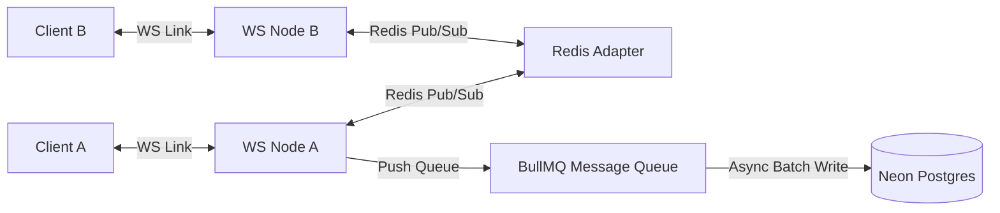

# CreatorOS ── SaaS Engineering Roadmap & Architecture

This document provides a detailed technical implementation blueprint and step-by-step roadmap to scale the **CreatorOS** mockup screens into a production-grade, highly-scalable multi-tenant SaaS platform. 

---

## 🛠️ System Architecture Overview

```
                      ┌────────────────────────────────────────┐
                      │            Client Viewports            │
                      │       (Desktop/Mobile Web App)         │
                      └──────────────────┬─────────────────────┘
                                         │ HTTPS / WSS
                                         ▼
                      ┌────────────────────────────────────────┐
                      │           Next.js App Router           │
                      │     (Hosting: Vercel / AWS Amplify)    │
                      └──────┬───────────┬──────────────┬──────┘
                             │           │              │
        Auth & Social APIs   │           │ Prisma ORM   │ AI & Payments
      ┌──────────────────────┘           │              └──────────────────────┐
      ▼                                  ▼                                     ▼
┌───────────┐                      ┌───────────┐                         ┌───────────┐
│ Meta API  │                      │   Neon    │                         │ OpenAI/X  │
│ (Instagram│                      │PostgreSQL │                         │ Gemini API│
│ Graph API)│                      │(pgvector) │                         └───────────┘
└───────────┘                      └─────┬─────┘                         ┌───────────┐
┌───────────┐                            │                               │ Razorpay  │
│ Clerk /   │                            │ Matches                       │  Route    │
│ NextAuth  │                            ▼                               └───────────┘
└───────────┘                      ┌───────────┐
                                   │  Redis /  │
                                   │  BullMQ   │ (Background Sync & Outreach)
                                   └───────────┘
```

---

## 💾 Database Schema (Prisma ORM)

The relational schema is optimized for a multi-tenant platform serving two distinct user roles: **Creators** and **Brand Sponsors** (similar to Unstop's ecosystem). It includes standard tables for authentication, profiles, campaigns, applications, messages, and escrow payments.

```prisma
// datasource and generator configurations
datasource db {
  provider = "postgresql"
  url      = env("DATABASE_URL")
}

generator client {
  provider = "prisma-client-js"
}

enum Role {
  CREATOR
  SPONSOR
  ADMIN
}

enum CampaignStatus {
  DRAFT
  ACTIVE
  PAUSED
  COMPLETED
}

enum ApplicationStatus {
  APPLIED
  CONTACTED
  NEGOTIATING
  APPROVED
  REJECTED
  WAITING
}

enum TransactionStatus {
  ESCROW_LOCKED
  DELIVERED_PENDING_APPROVAL
  RELEASED
  REFUNDED
}

model User {
  id            String    @id @default(uuid())
  email         String    @unique
  name          String?
  role          Role      @default(CREATOR)
  createdAt     DateTime  @default(now())
  updatedAt     DateTime  @updatedAt
  
  // Authentication relation (NextAuth / Clerk)
  accounts      Account[]
  sessions      Session[]

  // Profiles
  creatorProfile CreatorProfile?
  sponsorProfile SponsorProfile?

  // Messages
  sentMessages   Message[] @relation("SentMessages")
  receivedMessages Message[] @relation("ReceivedMessages")
}

model Account {
  id                 String   @id @default(uuid())
  userId             String
  type               String
  provider           String
  providerAccountId  String
  refresh_token      String?  @db.Text
  access_token       String?  @db.Text
  expires_at         Int?
  token_type         String?
  scope              String?
  id_token           String?  @db.Text
  session_state      String?

  user User @relation(fields: [userId], references: [id], onDelete: Cascade)

  @@unique([provider, providerAccountId])
}

model Session {
  id           String   @id @default(uuid())
  sessionToken String   @unique
  userId       String
  expires      DateTime
  user         User     @relation(fields: [userId], references: [id], onDelete: Cascade)
}

model CreatorProfile {
  id               String   @id @default(uuid())
  userId           String   @unique
  instagramHandle  String   @unique
  bio              String?  @db.Text
  niche            String   // e.g., "Tech & Gadgets", "Lifestyle"
  
  // Real-time statistics fetched from Instagram Graph API
  followerCount    Int      @default(0)
  engagementRate   Float    @default(0.0) // E.g., 8.7% -> 0.087
  averageViews     Int      @default(0)
  averageLikes     Int      @default(0)
  audienceDemo     Json?    // Demographics breakdown (age, gender, countries)
  
  // Semantic Vector Embedding for AI Matching (stored using pgvector)
  profileEmbedding Unsupported("vector(1536)")?

  // Integrations & Payments
  razorpayRouteId  String?  // Razorpay Route Linked Merchant Account ID for creator payouts
  metaAccessToken  String?  // Long-lived access token for Instagram Page

  // Relations
  user         User          @relation(fields: [userId], references: [id], onDelete: Cascade)
  applications Application[]
  contentItems ContentItem[]
  matches      Match[]
}

model SponsorProfile {
  id          String   @id @default(uuid())
  userId      String   @unique
  companyName String
  industry    String
  website     String
  logoUrl     String?

  // Relations
  user      User       @relation(fields: [userId], references: [id], onDelete: Cascade)
  campaigns Campaign[]
}

model Campaign {
  id             String         @id @default(uuid())
  sponsorId      String
  title          String
  description    String         @db.Text
  industry       String         // Target industry niche
  budget         Float          // Total campaign budget in USD
  creatorCriteria Json          // JSON object representing follower ranges, locations
  deliverables   String[]       // e.g., ["Reel", "Story"]
  status         CampaignStatus @default(DRAFT)
  createdAt      DateTime       @default(now())
  updatedAt      DateTime       @updatedAt

  // Semantic Vector Embedding for Campaign Criteria
  campaignEmbedding Unsupported("vector(1536)")?

  // Relations
  sponsor      SponsorProfile @relation(fields: [sponsorId], references: [id], onDelete: Cascade)
  applications Application[]
  matches      Match[]
}

model Match {
  id               String   @id @default(uuid())
  creatorProfileId String
  campaignId       String
  matchScore       Float    // Match Score (0.0 to 1.0)
  createdAt        DateTime @default(now())

  // Relations
  creator CreatorProfile @relation(fields: [creatorProfileId], references: [id], onDelete: Cascade)
  campaign Campaign       @relation(fields: [campaignId], references: [id], onDelete: Cascade)

  @@unique([creatorProfileId, campaignId])
}

model Application {
  id               String            @id @default(uuid())
  campaignId       String
  creatorProfileId String
  status           ApplicationStatus @default(APPLIED)
  appliedAt        DateTime          @default(now())
  updatedAt        DateTime          @updatedAt
  
  // Escrow Relation
  transaction      EscrowTransaction?

  // Relations
  campaign Campaign       @relation(fields: [campaignId], references: [id], onDelete: Cascade)
  creator  CreatorProfile @relation(fields: [creatorProfileId], references: [id], onDelete: Cascade)

  @@unique([campaignId, creatorProfileId])
}

model ContentItem {
  id               String      @id @default(uuid())
  creatorProfileId String
  title            String
  platform         String      // e.g., "Instagram", "YouTube"
  format           String      // e.g., "Reel", "Post", "Thread"
  status           String      // "Idea" | "Production" | "Review" | "Scheduled"
  scheduledAt      DateTime?
  mediaUrl         String?     // Link to draft / published asset
  createdAt        DateTime    @default(now())
  updatedAt        DateTime    @updatedAt

  // Relations
  creator CreatorProfile @relation(fields: [creatorProfileId], references: [id], onDelete: Cascade)
}

model Message {
  id          String   @id @default(uuid())
  senderId    String
  receiverId  String
  content     String   @db.Text
  isRead      Boolean  @default(false)
  createdAt   DateTime @default(now())

  // Relations
  sender   User @relation("SentMessages", fields: [senderId], references: [id], onDelete: Cascade)
  receiver User @relation("ReceivedMessages", fields: [receiverId], references: [id], onDelete: Cascade)
}

model EscrowTransaction {
  id                 String            @id @default(uuid())
  applicationId      String            @unique
  razorpayOrderId    String            // Razorpay Order ID for tracking the escrow
  razorpayPaymentId  String?           // Razorpay Payment ID captured
  razorpayTransferId String?           // Razorpay Route Transfer ID
  escrowStatus       TransactionStatus @default(ESCROW_LOCKED)
  amount             Float
  releasedAt         DateTime?
  createdAt          DateTime          @default(now())

  // Relations
  application Application @relation(fields: [applicationId], references: [id], onDelete: Cascade)
}
```

---

## 🔌 API & Integration Specifications

### 1. Instagram Graph API Data Pipeline
Creators authorize access via Facebook login. To sync metrics reliably without breaching rate limits:
*   **OAuth Scopes Required**: `instagram_basic`, `instagram_manage_insights`, `pages_show_list`, `pages_read_engagement`.
*   **Token Promotion**: Exchange the short-lived 2-hour client access token for a 60-day long-lived User Access Token via:
    `GET /oauth/access_token?grant_type=fb_exchange_token&client_id={app-id}&client_secret={app-secret}&fb_exchange_token={short-lived-token}`
*   **Insights Ingestion (Cron Job via BullMQ/Inngest)**:
    Sync creator statistics every 24 hours:
    ```javascript
    // Fetch follower count, bio, profile pic
    GET /v20.0/{instagram-business-account-id}?fields=followers_count,biography,profile_picture_url,media_count
    
    // Fetch media impressions & engagement for ER calculation (last 15 posts)
    GET /v20.0/{instagram-business-account-id}/media?fields=like_count,comments_count,media_type,timestamp&limit=15
    
    // Fetch audience demographic metrics
    GET /v20.0/{instagram-business-account-id}/insights?metric=audience_gender_age,audience_country&period=lifetime
    ```

### 2. AI-Driven Matchmaking Engine (`pgvector`)
We use embeddings to calculate a semantic match between Creator Profiles and Brand Campaigns:
1.  **Generate Profile Vectors**: Whenever a creator updates their bio/niche or their API audience data changes, generate a text payload (e.g., *"Creator niche: Tech, Bio: Unboxing custom mechanical keyboards, primary audience: 18-24 M in India"*). Pass this to the OpenAI Embedding API (`text-embedding-3-small`) to generate a 1536-dimensional vector. Store it in `CreatorProfile.profileEmbedding`.
2.  **Generate Campaign Vectors**: When a sponsor lists a campaign, build a similar text payload (e.g., *"Campaign Title: Silent Mechanical Keyboards promotion, target niche: Tech and Gadgets, target creator: micro size, target audience: student demographic"*). Generate a vector and store it in `Campaign.campaignEmbedding`.
3.  **Run SQL Vector Search**: Query matches using cosine distance in SQL:
    ```sql
    SELECT c.id, c.instagramHandle, 
           (1 - (c.profileEmbedding <=> :campaignEmbedding)) AS match_score
    FROM "CreatorProfile" c
    WHERE c.followerCount BETWEEN :minFollowers AND :maxFollowers
    ORDER BY match_score DESC
    LIMIT 20;
    ```
4.  **Match Score Harmonization**: Combine the semantic match score (60% weight) with engagement rate and industry category filters (40% weight) to produce the final dashboard percentages shown in `sponsorship_engine_creatoros`.

### 3. Escrow & Razorpay Route Payout Flow
Razorpay Route enables CreatorOS to collect payments from brand sponsors and automatically route/split funds to Connected Creator bank accounts (Node accounts) after deducting our platform fee.
1.  **Sponsor Deposits Funds**: On match approval, a Razorpay Order is created via API. The sponsor pays using the Razorpay checkout modal. The transaction is tagged for split routing but transfers are held in escrow:
    ```javascript
    const Razorpay = require('razorpay');
    const razorpay = new Razorpay({ key_id: 'KEY_ID', key_secret: 'KEY_SECRET' });

    const order = await razorpay.orders.create({
      amount: campaignBudgetInPaise, // e.g. 500000 paise for ₹5,000
      currency: 'INR',
      receipt: `camp_app_${applicationId}`,
      payment_capture: 1,
    });
    ```
2.  **Verification of Deliverables**: The background worker (Inngest/BullMQ) verifies the live Instagram Reel link using the Meta Graph API (checks hashtag `#ad`, tag verification, and 24h lifespan).
3.  **Release of Escrow (Route Transfer)**: Once verification succeeds, CreatorOS triggers a Transfer to split the payment between the platform (platform fee) and the creator's connected bank account:
    ```javascript
    const transfer = await razorpay.payments.transfer(paymentId, {
      transfers: [
        {
          account: creatorProfile.razorpayRouteId, // Creator's linked merchant account ID
          amount: creatorShareInPaise,
          currency: 'INR',
          notes: { applicationId: applicationId },
          linked_account_notes: ['sponsorship_payout']
        }
      ]
    });
    ```

### 4. Meta App Review & API Access Setup
To connect with the Instagram Graph API and read creator statistics or verify deliverables in production, the application must pass Meta App Review.
1.  **Setup Sandbox Environment**:
    *   Create a Meta App (Type: *Business*) in the Meta App Dashboard.
    *   Configure Facebook Login for Business and add the Instagram Graph API product.
    *   Add creator test accounts as *App Testers* or *Developers* in the app role tab. This allows full Graph API queries during development without review.
2.  **Prerequisites for Submission**:
    *   **Business Verification**: Verify the platform's registered business organization using business documents (GST/Certificate of Incorporation) in the Meta Business Manager.
    *   **Privacy Policy & Terms**: Host a live, compliant privacy policy and a working endpoint for the Data Deletion callback (e.g., `/api/auth/meta/data-deletion`).
3.  **Required Scopes for Submission**:
    *   `instagram_basic`: To read base profile details, follower counts, and username.
    *   `instagram_manage_insights`: To ingest analytics demographics (age/gender/countries) and media metrics.
    *   `pages_read_engagement`: To fetch page-level metrics linked to the Instagram Creator account.
4.  **Submission Package**:
    *   Prepare a step-by-step screencast demonstrating the exact creator onboarding login flow: Creator clicks "Connect Instagram" -> Facebook Login oauth screen displays required permissions checkboxes -> Creator checks permissions -> Redirection to CreatorOS dashboard showing synchronized metrics.
    *   Provide detailed developer credentials and test user accounts for the review team to simulate the flow.

### 5. Real-Time WebSocket System Design & Scaling
To ensure highly-scalable, real-time chat between creators and sponsors, the platform utilizes WebSockets structured around core system design principles.



1.  **WebSocket Cluster (Socket.io)**: WebSocket connections are terminated at a cluster of stateless Node.js WebSocket instances hosted behind a Load Balancer (e.g., Nginx or AWS Application Load Balancer with sticky sessions enabled for WebSocket handshakes).
2.  **Horizontal Scale with Redis Pub/Sub**: Use `@socket.io/redis-adapter` backed by an AWS ElastiCache or Redis cluster. When Client A sends a message to Client B, the message is pushed to Redis Pub/Sub. Redis broadcasts it to all WebSocket nodes, ensuring the message reaches Client B regardless of which WebSocket node they are connected to.
3.  **Database Connection Pooling & Write-Behind**:
    *   *Problem*: Direct database writes on every chat message in a high-traffic environment can exhaust Neon PostgreSQL connections and cause transaction latency.
    *   *Solution*: Implement a Write-Behind Caching pattern. WebSocket servers write incoming chat messages to a Redis Stream/Queue. A worker (BullMQ) pulls messages from the queue and executes batch inserts into Neon PostgreSQL every 2-3 seconds, utilizing **Prisma Transaction Client** to optimize connection pool usage.
4.  **Security & Room Authentication**: WebSocket client handshakes require auth token validation (JWT). Messages are segmented into distinct rooms named by deal/application ID (e.g. `room_deal_123`). Before joining, the backend queries Redis/PostgreSQL to verify the user belongs to that room (is either the creator or the sponsor).

---

## 📅 Implementation Plan: Phase-by-Phase

### Phase 1: Core Authentication & Social Sync (Weeks 1-2)
*   **Goal**: Establish Next.js application shell, deploy DB on Neon, implement Auth and Instagram API metrics ingestion.
*   **Milestones**:
    *   Initialize Next.js App Router with TypeScript.
    *   Configure Prisma Client and deploy the initial PostgreSQL migration.
    *   Set up NextAuth / Clerk. Implement Facebook & Instagram OAuth login.
    *   Implement Meta API sync script (background worker fetching follower count, engagement metrics, media data).
    *   Build the creator onboarding profile wizard.

### Phase 2: Sponsor Campaigns & Matchmaking Engine (Weeks 3-4)
*   **Goal**: Enable sponsors to create campaigns and build the `pgvector` matchmaking logic.
*   **Milestones**:
    *   Create the Sponsor Campaign Creator Wizard (industries, budgets, deliverables list).
    *   Set up pgvector extension in Neon PostgreSQL.
    *   Implement backend hooks to trigger embedding generation upon Campaign/Creator Profile edits.
    *   Write the matchmaking SQL query.
    *   Populate the Match CRM dashboard with real matched entries.

### Phase 3: Content Studio & Calendar Workflow (Week 5)
*   **Goal**: Build the writing tools and visual planning pipeline.
*   **Milestones**:
    *   Integrate Google Gemini API / OpenAI SDK to generate creator proposals, script hooks, and caption variations based on Brand Campaign requirements.
    *   Build the Kanban board view. Sync state changes (`Backlog` -> `In Production` -> `Review` -> `Scheduled`) with the Postgres database.
    *   Render the calendar grid showing scheduled posts dynamically.

### Phase 4: Razorpay Escrow Integration, WebSockets, & CRM Outreach (Weeks 6-7)
*   **Goal**: Secure campaign funds via Razorpay Route, deploy real-time WebSocket chat architecture, and automate CRM outreaches.
*   **Milestones**:
    *   Create Razorpay Webhook endpoints. Implement Razorpay Checkout order flows for brands.
    *   Create the Razorpay Route onboarding/connected account endpoints for creators.
    *   Deploy the Socket.io WebSocket server node cluster with the Redis Pub/Sub Adapter.
    *   Write the automated deliverable checker worker (checking Instagram API for live reels with specific tags).
    *   Implement Outreach CRM tracking page. Allow creators to automatically generate and send cold outreach emails from the dashboard.

### Phase 5: Testing, Optimizations, & Deployment (Week 8)
*   **Goal**: Secure the platform, run end-to-end integration tests, submit App review, and deploy.
*   **Milestones**:
    *   Perform comprehensive security audits (verifying role-based access, securing API routes, encrypting Meta API access tokens in db).
    *   Submit the Facebook/Instagram App for Meta App Review with walkthrough screencasts and data privacy callbacks.
    *   Deploy Next.js build on Vercel, WebSocket servers on AWS ECS/Fargate, and configure Redis on Upstash or AWS ElastiCache.
    *   Implement Prometheus/Grafana or Vercel Analytics monitoring to track API call latency and database CPU usage.
    *   Deliver finalized walkthrough and launch.
